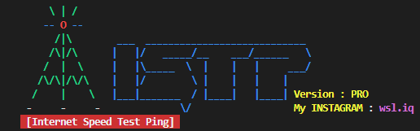

### What is a tool ISTP?
```
It is an abbreviation of the word (Speed Test Ping).
The tool scans your Internet through the following processes:
1- [Download] It checks the speed of your incoming Internet or reception in terms of speed in two sizes [Mbps][MB/s].
2- [Upload] checks the Internet upload coming from your device or transmission on two scales [Mbps][MB/s].
3- [Ping] means a network utility that indicates the signal sent over the network to another computer, and then sends its own signal again. This signal, which is measured in milliseconds (ms), lets you know how long it takes for a data packet to travel from your computer to a server on the Internet and vice versa and is measured in [ms].
4- [Host] In short, it shows you the hosting address.
5- [SPONSOR] displays the service provider provided by commercial and government companies.
6- [ISP] Shows the name of the Internet service provider you are using.
7- [Country] The name of the country in which the Internet speed test was performed is displayed.
8- [URL] It gives a direct link or snapshot of an internet speed check from the website (Speet Test) that you can use to test your download speed directly.
9- [Hosted By] Shows the name of the organization or server hosting the speed test.
10- [Packet Loss] It expresses the percentage of packets that are lost during the ping process.
11- [Server ID] Each test server is known by a unique identifier, which is useful when deciding which server you want to use.
12- [ISP Rating] Some tools can provide a rating of the service provider based on connection performance, giving a general idea of the quality of service provided.
```


### Internet Speed Test Ping
```
 ___  ____________________________ 
|   |/   _____/__    ___/______   \
|   |\_____  \  |    |   |     ___/
|   |/        \ |    |   |    |    
|___|_______  / |____|   |____|    
            \/                                       
```

### What's ISTP
```
* Improvements have been added, such as a download display that indicates the scanning process on the Internet, in addition to displaying the network IP address and network name for the [windows] system and displaying the IP address for the [linux] system.
In addition to improvements in the banner.
* Improve the interface and make it scan automatically without your intervention.
* Check your connection to the Internet.
* Displaying results in the form of fields, making them easier and better understood than previous versions
* The tool has become faster than it was before.
* 7 features have been added, including completing an Internet scan in your country, including the following additions:
(ISP) , (Country) , (URL) ,  (Hosted By) ,  (Packet Loss) ,  (Server ID) ,  (ISP Rating).
* Add a clock and calendar to know when and at what time you checked your Internet.
```
### Installation system Windows
```
1- Download File ZIP
2- unzip file ISTP
$ cd ISTP
$ install.bat
$ python istp.py
```

### Installation system Linux

```
$ git clone https://github.com/wsl-iq/ISTP.git
$ cd ISTP
$ chmod +x *
$ sudo ./install.sh
$ pip3 install -r requirements.txt
$ python3 istp.py
```
### Installation system Android in Applications 'Termux'

```
$ git clone https://github.com/wsl-iq/ISTP.git
$ cd ISTP
$ chmod +x *
$ ./install.sh
$ pip3 install -r requirements.txt
$ python3 Android.py
```
### Check via website Type command

```
$ python3 server.py
```
### ScreenShot


### work on systems

```
1- Linux
2- Windows
3- MacBook
4- Android (Termux)
```
